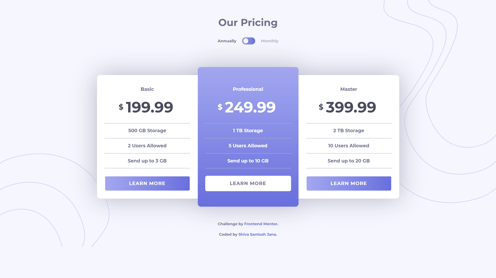
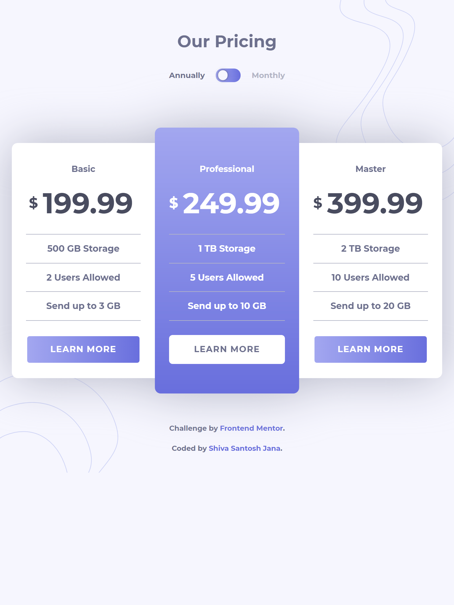
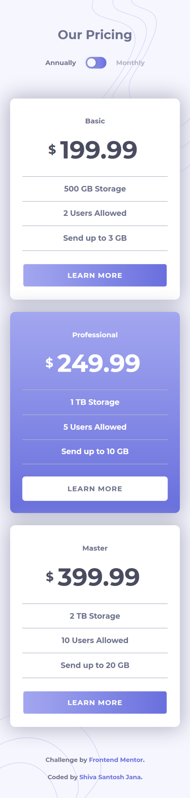

# Frontend Mentor - Pricing component with toggle solution

This is a solution to the [Pricing component with toggle challenge on Frontend Mentor](https://www.frontendmentor.io/challenges/pricing-component-with-toggle-8vPwRMIC). Frontend Mentor challenges help you improve your coding skills by building realistic projects.

## Table of contents

- [Overview](#overview)
  - [The challenge](#the-challenge)
  - [Screenshots](#screenshots)
  - [Links](#links)
- [My process](#my-process)
  - [Built with](#built-with)
  - [What I learned](#what-i-learned)
  - [Continued development](#continued-development)
  - [Useful resources](#useful-resources)
- [Author](#author)

## Overview

### The challenge

Users should be able to:

- View the optimal layout for the component depending on their device's screen size
- Control the toggle with both their mouse/trackpad and their keyboard
- **Bonus**: Complete the challenge with just HTML and CSS

### Screenshot

Desktop version

Tablet version

Mobile version

### Links

- Solution URL: [Code on GitHub](https://github.com/santu369/frontendmentor-pricing-component-with-toggle-and-js)
- Live Site URL: [Netlify Live URL](https://santu369-frontendmentor-pricing-component-with-toggle-and-js.netlify.app/)

## My process

Worked on Mobile first approach, then added media queries, adjusting the layout.
Used Bootstrap for layout and Gulp task runner for automating tasks in this project.

### Built with

- Semantic HTML5 markup
- CSS custom properties
- Flexbox
- Mobile-first workflow
- BEM Methodology
- SASS
- Bootstrap
- Gulp

### What I learned

Learned how to use Gulp task runner to automate tasks like compiling sass, applying vendor prefixes, minifying css, transpile js into backwards compatible version of js which can run on old browsers.
Creating accessible toggle button using button, checkbox and radio buttons.
Splitting SASS to multiple files in an organized way by creating folders for different purposes.

### Continued development

Will continue to work more on SASS and complete the bonus challenge for this project which is to create the same existing effect without any js. Also learn React and use it for future projects.

### Useful resources

- [Browsersync + Sass + Gulp Setup Video](https://www.youtube.com/watch?v=q0E1hbcj-NI) - Browsersync + Sass + Gulp in 15 minutes By [Coder Coder](https://twitter.com/thecodercoder).
- [Sass](https://sass-lang.com/) - Installing and Learning Sass.
- [BEM](https://en.bem.info/methodology/quick-start/) - Quick Start with BEM.
- [W3C Markup Validation Service](https://validator.w3.org/) - Validator for checking the markup validity of Web documents in HTML, XHTML, SMIL, MathML, etc.
- [W3C CSS Validation Service](https://jigsaw.w3.org/css-validator/) - Check Cascading Style Sheets (CSS) and (X)HTML documents with style sheets.
- [Bootstrap CSS](https://getbootstrap.com/docs/5.0/getting-started/introduction/) - Getting started with Bootstrap.
- [Gulp](https://gulpjs.com/) - A toolkit to automate & enhance your workflow.
- [babel](https://babeljs.io/) - Convert ECMAScript 2015+ (ES6+) code into a backwards compatible version of JavaScript.
- [autoprefixer](https://www.npmjs.com/package/autoprefixer) - PostCSS plugin to parse CSS and add vendor prefixes to CSS rules.
- [browser-sync](https://www.npmjs.com/package/browser-sync) - Live CSS Reload & Browser Syncing.
- [cssnano](https://www.npmjs.com/package/cssnano) - CSS minifier, built on top of the PostCSS ecosystem.
- [postcss](https://postcss.org/) - JavaScript-based plugins to automate routine CSS operations.

## Author

- Website - [Shiva Santosh Jana](https://santu369.github.io/FreeCodeCamp-PersonalPortfolioWebpage)
- Frontend Mentor - [@santu369](https://www.frontendmentor.io/profile/santu369)
- Twitter - [@santu69](https://www.twitter.com/santu69)
